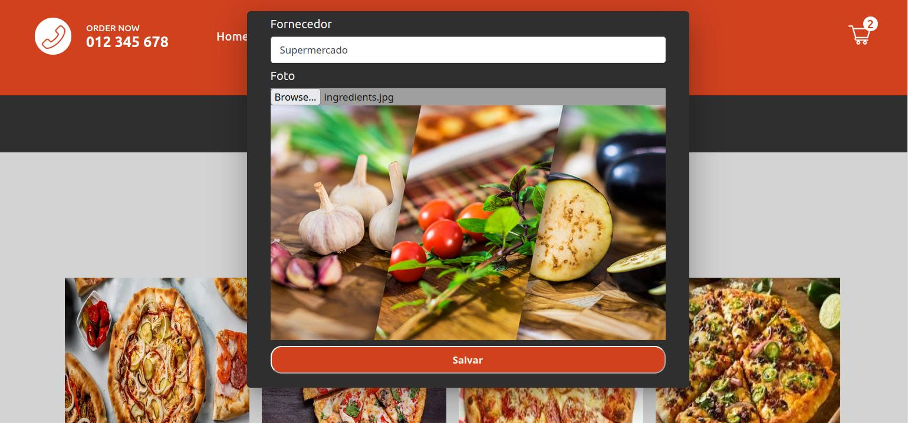

# MatteosPizza
A Responsive Restaurant Website using NEXT.js

## Project forked from:   https://github.com/BinaryLeo/next_js_pizza_ordering
- Alterações:
- Conversão do projeto para Typescript
- Adicionado script de banco e Endpoint no backend
- Adicionado fetch de API e listagem de items da API
- Criação de fature para upload de pizzas personalizadas
- Criação de feature para upload de ingredientes

## Steps to run the project
- npm install
- .env
- prisma db push
- prisma db seed
